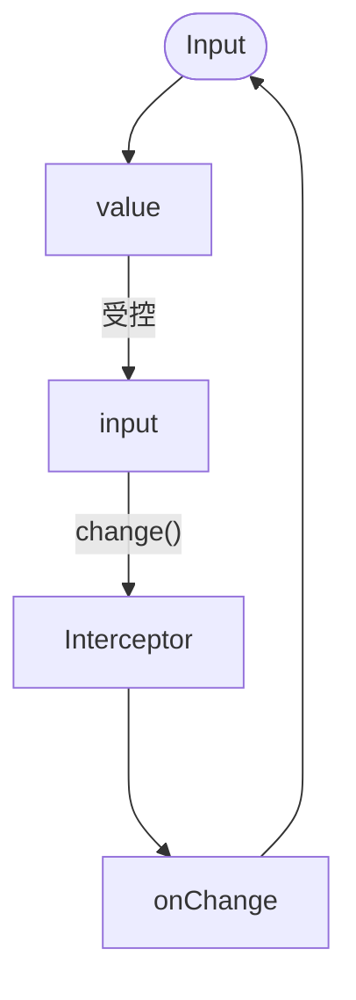

核心:


- 去掉的功能:
  - prefixBtn/suffixBtn/readonly/下边框模式/状态色
  
- 容器和内部 input 的 ref 都要能获取到

- notBorder -> border

- inputDirection -> textDirection

- 设置最佳显示宽度, 并添加 fullWidth 配置

- 数字输入处理

  - 输入无效值时, 取消焦点时还原值

- 拦截器

  - 提供简单的输入值拦截和过滤功能, 附带简单的光标操作api用来给用户手动修复光标位置

  - parser 可以显式返回false来禁止同步

    ```
    cursor = [start, end]
    
    Interceptor(str, cursor) {	
    	return str + '.';
    	
    	return false; // 阻止更新
    	
    	return [str, cursor]; // 如果对字符串长度进行了变更, 需要修复变更后的光标位置
    }
    ```

    





FiledWrap 

代理显示placeholder

聚焦样式控制

打组件/ 多行输入

有边框/无边框/下边框

**支持左label 右输入框布局**


```
  /** 数值的最大值 */
  max?: number;
  /** 数值的最小值 */
  min?: number;
  /** 启用步进器, 在右侧显示数值增减按钮 */
  stepper?: number;
  /** 数值步进 */
  step?: number;
```


## ❌格式化

> 格式化功能完全废弃, 因为在提供自定义格式化器的情况下, 要完美修正光标位置需要两个前提:  
>
> 1. 知道变更前光标位置. 2. 知道字符串格式化后光标左侧新增的字符数
>
> 
>
>  改为提供简单的拦截器, 用于实现输入值限制等(比如数值不能输入多个点, 不能包含指定字符等), 也可以提供光标和相关api让用户自行修正光标位置


- 简化 api, 提供 fmt 实例数组, fmt.formatter, fmt?.parser
- 预设 format 改为通过 fmt 对象提供
- 格式化后, 光标位置如何处理?


#1 由于需要处理中间值, 比如小数输到一半(`12.`), 合成事件, 不能实时的双向绑定值, 所有值变更通过 set 方法来触发, 从而达到更精准的控制


**合成事件/未完成的输入**

输入法输入(合成事件), 未完成的输入(小数等), 在parser前中断值变更反馈


**格式化后如何还原光标位置?**

某些会变更长度的 formatter 需要手动修正光标位置, 可通过如下 api 实现, 兼容性还不错

```js
HTMLInputElement.setSelectionRange;
HTMLInputElement.selectionEnd;
```

经实验, 手动记录并还原光标方案不可行,  期望是获取前后值的长短diff值 + 光标之前的位置, 并根据diff值和之前的光标位置调整光标, 但是不能准确知道diff新增或删除的数量是在光标前还是之后(输入/删除/粘贴/value直接被改变), 因素太多了


